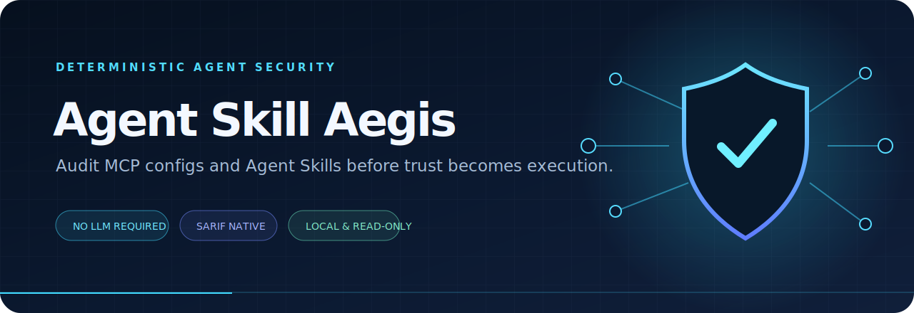
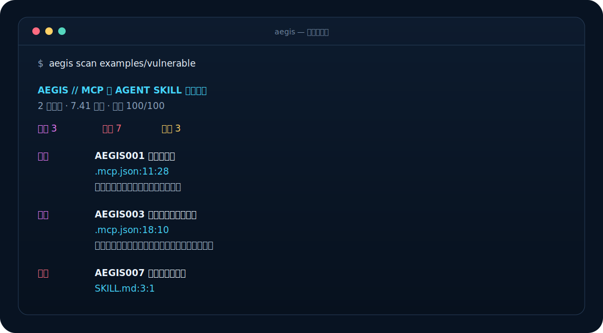
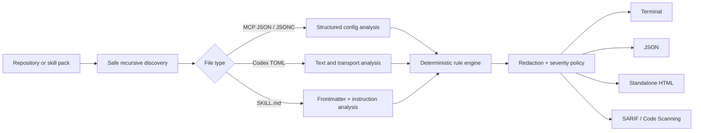

<div align="center">
  

  <br>

  [](https://github.com/abc123dx/agent-skill-aegis/actions/workflows/ci.yml)
  [](https://nodejs.org/)
  [](https://docs.oasis-open.org/sarif/sarif/v2.1.0/)
  [](LICENSE)

  **A local, deterministic supply-chain scanner for MCP configurations and Agent Skills.**

  Catch exposed secrets, floating executables, dangerous bootstrap commands,
  excessive permissions, insecure transport, and hostile instructions before
  an agent turns configuration into execution.
</div>

## Why Aegis

MCP servers and Agent Skills sit directly on an AI agent's trust boundary.
Small configuration changes can introduce a new executable, expose a home
directory, or add instructions that quietly redirect sensitive data.

Agent Skill Aegis gives those files a fast security gate:

- **Deterministic** — every finding comes from an inspectable rule, not an LLM.
- **Local and read-only** — no file content leaves the machine; scanned commands
  are never executed and symbolic links are never followed.
- **CI-native** — terminal output for humans, JSON for automation, standalone
  HTML for review, and SARIF 2.1.0 for GitHub Code Scanning.
- **Actionable** — stable rule IDs, precise locations, redacted evidence, and a
  least-privilege remediation on every finding.
- **Fast by default** — no model download, API key, daemon, or external service.

<p align="center">
  
</p>

## Quick start

```bash
# Install and run from the repository
git clone https://github.com/abc123dx/agent-skill-aegis.git
cd agent-skill-aegis
npm ci
npm run build
npm link
agent-skill-aegis scan examples/vulnerable --fail-on never
```

After the `v0.1.0` GitHub tag is available, it can also be installed directly
from that immutable release:

```bash
npm install --global github:abc123dx/agent-skill-aegis#v0.1.0
agent-skill-aegis scan .
```

The shorter `npx agent-skill-aegis` form will become available only after the
package is published to the npm registry; this repository does not claim that
registry release yet.

Scan a repository and fail when a high or critical finding exists:

```bash
agent-skill-aegis scan . --fail-on high
```

Create portable reports:

```bash
agent-skill-aegis scan . --format json  --output aegis.json
agent-skill-aegis scan . --format html  --output aegis-report.html
agent-skill-aegis scan . --format sarif --output aegis.sarif
```

The CLI returns `0` when the configured policy passes, `1` when a finding meets
the `--fail-on` threshold, and `2` for an operational or usage error.

## What it finds

| Rule | Severity | Signal |
| --- | --- | --- |
| `AEGIS001` | Critical | Hard-coded API keys, tokens, secrets, and passwords |
| `AEGIS002` | High | `npx` or `uvx` executable dependencies without an exact version |
| `AEGIS003` | Critical | Download-and-execute patterns such as `curl … \| bash` |
| `AEGIS004` | High | Shell indirection, destructive deletion, and permissive `chmod` |
| `AEGIS005` | High | Filesystem roots, full home directories, and broad wildcards |
| `AEGIS006` | Medium | Clear-text HTTP endpoints outside loopback |
| `AEGIS007` | High | Instructions that override prior, system, or developer context |
| `AEGIS008` | Critical | Instructions to transmit secrets, credentials, files, or user data |
| `AEGIS009` | Medium | Missing `name` or `description` in Agent Skill frontmatter |
| `AEGIS010` | Medium | World-writable MCP configuration or `SKILL.md` |
| `AEGIS011` | High | Invalid JSON/JSONC configuration |
| `AEGIS012` | High | Instructions that conceal consequential behavior from the user |

Credential evidence is redacted before it reaches any reporter. The repository
includes both a [safe example](examples/safe) and a deliberately
[vulnerable example](examples/vulnerable) so every risk is easy to reproduce
without using live data.

## Discovery

Aegis recursively discovers:

- `.mcp.json`, `mcp.json`, `mcp.jsonc`, `*.mcp.json`, and `mcp_config.json`;
- Cursor and VS Code MCP files through their standard `mcp.json` names;
- `claude_desktop_config.json`;
- `.codex/config.toml`;
- `opencode.json` and `opencode.jsonc`; and
- `SKILL.md` in any Agent Skill layout.

It skips `.git`, dependencies, virtual environments, generated builds, coverage
output, symbolic links, and candidate files larger than 1 MiB by default.

## Architecture



The analyzer never resolves a package, starts a configured process, or connects
to a discovered endpoint. This keeps an audit from becoming the execution path
it is supposed to inspect.

## GitHub Action

Add a security gate with the reusable composite action:

```yaml
name: Agent configuration security

on:
  pull_request:

permissions:
  contents: read
  security-events: write

jobs:
  aegis:
    runs-on: ubuntu-latest
    steps:
      - uses: actions/checkout@v4

      - name: Audit MCP and Agent Skill files
        uses: abc123dx/agent-skill-aegis@v0.1.0
        with:
          path: .
          format: sarif
          output: aegis.sarif
          fail-on: high

      - name: Upload security findings
        if: always()
        uses: github/codeql-action/upload-sarif@v3
        with:
          sarif_file: aegis.sarif
```

For production use, pin third-party actions—including Aegis—to a reviewed
commit SHA and automate intentional updates.

## CLI reference

```text
Usage: agent-skill-aegis scan [options] [path]

Options:
  -f, --format <format>        terminal, json, html, or sarif
  -o, --output <file>          write the report to a file
  --fail-on <severity>         critical, high, medium, low, info, or never
  --max-file-size <bytes>      maximum candidate file size (default: 1048576)
  --no-color                   disable ANSI colors
  -q, --quiet                  suppress stdout when --output is used
```

`--fail-on high` is the default. Use `--fail-on never` to produce an inventory
without enforcing a policy.

## Library API

The scanner and reporters are also exported as typed ESM modules:

```ts
import {
  renderSarif,
  scanProject,
  shouldFail
} from "agent-skill-aegis";

const result = await scanProject("./skills");
const sarif = renderSarif(result);

if (shouldFail(result, "high")) {
  process.exitCode = 1;
}
```

The JSON result declares `schemaVersion: "1.0"` and includes the tool version,
scan root, timestamp, duration, file count, normalized findings, severity
counts, and a bounded risk score.

## Security model and limitations

Aegis is a focused static analyzer. It can identify risky configuration and
instruction patterns; it cannot prove that a downloaded package is benign,
observe runtime-only behavior, or replace sandboxing, provenance verification,
egress controls, and human review.

Reports may contain local file paths and matched instruction text. Store them
as security artifacts. See [SECURITY.md](SECURITY.md) for private disclosure
and scanner safety details.

## 中文快速说明

Agent Skill Aegis 是一个面向 MCP 配置和 `SKILL.md` 的本地安全审计工具：
不调用大模型、不上传文件、也不会执行被扫描的命令。

```bash
# 从源码安装
git clone https://github.com/abc123dx/agent-skill-aegis.git
cd agent-skill-aegis
npm ci && npm run build && npm link

# 扫描当前项目；发现高危或严重问题时退出码为 1
agent-skill-aegis scan . --fail-on high

# 生成可直接查看的独立 HTML 报告
agent-skill-aegis scan . --format html --output aegis-report.html

# 生成 GitHub Code Scanning 可识别的 SARIF
agent-skill-aegis scan . --format sarif --output aegis.sarif
```

它会检查明文密钥、未锁定版本的 `npx`/`uvx`、下载后直接执行、危险
Shell、过宽文件权限、不安全 HTTP、Prompt Injection、数据外传与元数据
缺失。建议把它放进 Pull Request CI，并配合沙箱、最小权限和人工审查。

## Roadmap

- [x] MCP and Agent Skill discovery
- [x] Deterministic credential, dependency, permission, and prompt rules
- [x] Terminal, JSON, HTML, and SARIF reporters
- [x] Reusable GitHub Action
- [ ] Rule suppression with expiring, documented exceptions
- [ ] Provenance-aware package allowlists
- [ ] Baseline comparison for pull-request-only findings
- [ ] Optional editor diagnostics through the Language Server Protocol

## Contributing

Rule proposals and false-positive reductions are welcome. Read
[CONTRIBUTING.md](CONTRIBUTING.md) before opening a pull request. New rules
must include a deterministic threat signal, safe and unsafe fixtures, precise
remediation, and tests.

Released under the [MIT License](LICENSE).
