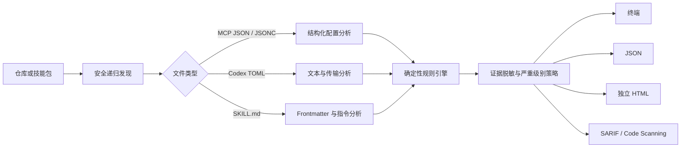

<div align="center">
  

  <br>

  
  [](https://nodejs.org/)
  [](https://docs.oasis-open.org/sarif/sarif/v2.1.0/)
  [](LICENSE)

  **面向 MCP 配置与 Agent Skill 的本地、确定性供应链安全扫描器。**

  在 Agent 把配置变成真实执行之前，发现明文密钥、浮动版本依赖、
  危险引导命令、过宽权限、不安全传输与恶意指令。
</div>

## 为什么需要 Aegis

MCP 服务器与 Agent Skill 正位于 AI Agent 的信任边界上。一处很小的配置
变更，就可能引入新的可执行文件、暴露整个主目录，或加入悄悄转移敏感数据
的指令。

Agent Skill Aegis 为这些文件提供快速、可审计的安全门禁：

- **结果确定**：每条问题都来自可检查的规则，不依赖大模型判断。
- **本地只读**：文件内容不会离开本机；扫描到的命令不会被执行，符号链接
  也不会被跟随。
- **适合 CI**：同时提供面向人的终端报告、面向自动化的 JSON、可独立查看
  的 HTML，以及可接入 GitHub Code Scanning 的 SARIF 2.1.0。
- **可直接修复**：每条问题都包含稳定的规则 ID、精确位置、脱敏证据与
  最小权限修复建议。
- **开箱即用**：无需下载模型，也无需 API Key、守护进程或外部服务。

<p align="center">
  
</p>

## 快速开始

```bash
# 从仓库安装并运行
git clone https://github.com/abc123dx/agent-skill-aegis.git
cd agent-skill-aegis
npm ci
npm run build
npm link
agent-skill-aegis scan examples/vulnerable --fail-on never
```

也可以直接从不可变的 `v0.1.1` GitHub 版本安装：

```bash
npm install --global github:abc123dx/agent-skill-aegis#v0.1.1
agent-skill-aegis scan .
```

只有在软件包正式发布到 npm registry 后，较短的
`npx agent-skill-aegis` 形式才可直接使用；本仓库目前不宣称已有 npm
registry 版本。

扫描仓库，并在出现高危或严重问题时使命令失败：

```bash
agent-skill-aegis scan . --fail-on high
```

生成可移植报告：

```bash
agent-skill-aegis scan . --format json  --output aegis.json
agent-skill-aegis scan . --format html  --output aegis-report.html
agent-skill-aegis scan . --format sarif --output aegis.sarif
```

当配置的安全策略通过时，CLI 返回 `0`；当问题达到 `--fail-on` 阈值时返回
`1`；遇到运行或用法错误时返回 `2`。

## 可检测的问题

| 规则 | 严重级别 | 检测信号 |
| --- | --- | --- |
| `AEGIS001` | 严重 | 硬编码的 API Key、Token、密钥与密码 |
| `AEGIS002` | 高危 | 没有锁定精确版本的 `npx` 或 `uvx` 可执行依赖 |
| `AEGIS003` | 严重 | `curl … \| bash` 等下载后直接执行模式 |
| `AEGIS004` | 高危 | Shell 间接执行、破坏性删除与宽松的 `chmod` |
| `AEGIS005` | 高危 | 文件系统根目录、完整主目录与范围过宽的通配符 |
| `AEGIS006` | 中危 | 回环地址之外的明文 HTTP 端点 |
| `AEGIS007` | 高危 | 试图覆盖先前、系统或开发者上下文的指令 |
| `AEGIS008` | 严重 | 要求传输密钥、凭据、文件或用户数据的指令 |
| `AEGIS009` | 中危 | Agent Skill frontmatter 缺少 `name` 或 `description` |
| `AEGIS010` | 中危 | MCP 配置或 `SKILL.md` 可被任意本地用户写入 |
| `AEGIS011` | 高危 | 无效的 JSON/JSONC 配置 |
| `AEGIS012` | 高危 | 要求向用户隐瞒重要行为的指令 |

凭据证据在进入任何报告器之前都会被脱敏。仓库同时包含
[安全示例](examples/safe)和故意设计的[高风险示例](examples/vulnerable)，
无需使用真实数据即可复现每类风险。

## 文件发现

Aegis 会递归发现：

- `.mcp.json`、`mcp.json`、`mcp.jsonc`、`*.mcp.json` 与
  `mcp_config.json`；
- Cursor 与 VS Code 使用标准 `mcp.json` 文件名的 MCP 配置；
- `claude_desktop_config.json`；
- `.codex/config.toml`；
- `opencode.json` 与 `opencode.jsonc`；
- 任意 Agent Skill 布局中的 `SKILL.md`。

默认跳过 `.git`、依赖目录、虚拟环境、构建产物、覆盖率输出、符号链接，
以及大于 1 MiB 的候选文件。

## 工作原理



分析器不会解析或安装软件包，不会启动配置中的进程，也不会连接发现的
端点，因此安全审计本身不会变成其试图检查的执行路径。

## GitHub Action

使用可复用的组合 Action 添加安全门禁：

```yaml
name: Agent 配置安全检查

on:
  pull_request:

permissions:
  contents: read
  security-events: write

jobs:
  aegis:
    runs-on: ubuntu-latest
    steps:
      - uses: actions/checkout@v4

      - name: 审计 MCP 与 Agent Skill 文件
        uses: abc123dx/agent-skill-aegis@v0.1.1
        with:
          path: .
          format: sarif
          output: aegis.sarif
          fail-on: high

      - name: 上传安全问题
        if: always()
        uses: github/codeql-action/upload-sarif@v3
        with:
          sarif_file: aegis.sarif
```

生产环境应将第三方 Action（包括 Aegis）固定到经过审查的提交 SHA，并对
升级进行有意识的自动化管理。

## CLI 参考

```text
用法： agent-skill-aegis scan [options] [path]

参数：
  path                          要扫描的目录

选项：
  -f, --format <format>         报告格式：terminal、json、html 或 sarif
  -o, --output <file>           将报告写入文件
  --fail-on <severity>          达到此严重级别时以 1 退出，never 表示永不拦截
  --max-file-size <bytes>       跳过大于此字节数的候选文件
  --no-color                    禁用 ANSI 颜色
  -q, --quiet                   使用 --output 时不输出到标准输出
  -h, --help                    显示帮助
```

默认值为 `--fail-on high`。使用 `--fail-on never` 可只生成问题清单而不
执行拦截策略。命令、参数名、报告格式与原始严重级别枚举保持英文，以确保
脚本和已有集成继续兼容。

## 库 API

扫描器与报告器也以带类型的 ESM 模块导出：

```ts
import {
  renderSarif,
  scanProject,
  shouldFail
} from "agent-skill-aegis";

const result = await scanProject("./skills");
const sarif = renderSarif(result);

if (shouldFail(result, "high")) {
  process.exitCode = 1;
}
```

JSON 结果继续声明 `schemaVersion: "1.0"`，并包含工具版本、扫描根目录、
时间戳、耗时、文件数、标准化问题、严重级别统计与有界风险评分。v0.1.1
仅汉化用户可见内容，不改变 JSON/SARIF 字段、规则 ID、CLI flags、
严重级别枚举或退出码。

## 安全模型与限制

Aegis 是一款聚焦静态分析的工具。它可以识别高风险配置与指令模式，但
无法证明下载的软件包一定安全，无法观察仅在运行时出现的行为，也不能
替代沙箱、来源验证、出站流量控制与人工审查。

报告可能包含本地文件路径与命中的指令文本，应按安全制品妥善保存。私密
披露流程与扫描器安全边界请参阅 [SECURITY.md](SECURITY.md)。

## 路线图

- [x] 发现 MCP 与 Agent Skill 文件
- [x] 确定性的凭据、依赖、权限与提示词规则
- [x] 终端、JSON、HTML 与 SARIF 报告器
- [x] 可复用 GitHub Action
- [ ] 支持带有效期和说明的规则例外
- [ ] 感知来源证明的软件包允许列表
- [ ] 仅针对 Pull Request 新增问题的基线比较
- [ ] 通过 Language Server Protocol 提供可选编辑器诊断

## 参与贡献

欢迎提交规则提案与降低误报的改进。发起 Pull Request 前请阅读
[CONTRIBUTING.md](CONTRIBUTING.md)。新规则必须包含确定性的威胁信号、
安全与不安全测试样例、精确修复建议及自动化测试。

本项目采用 [MIT License](LICENSE)。
